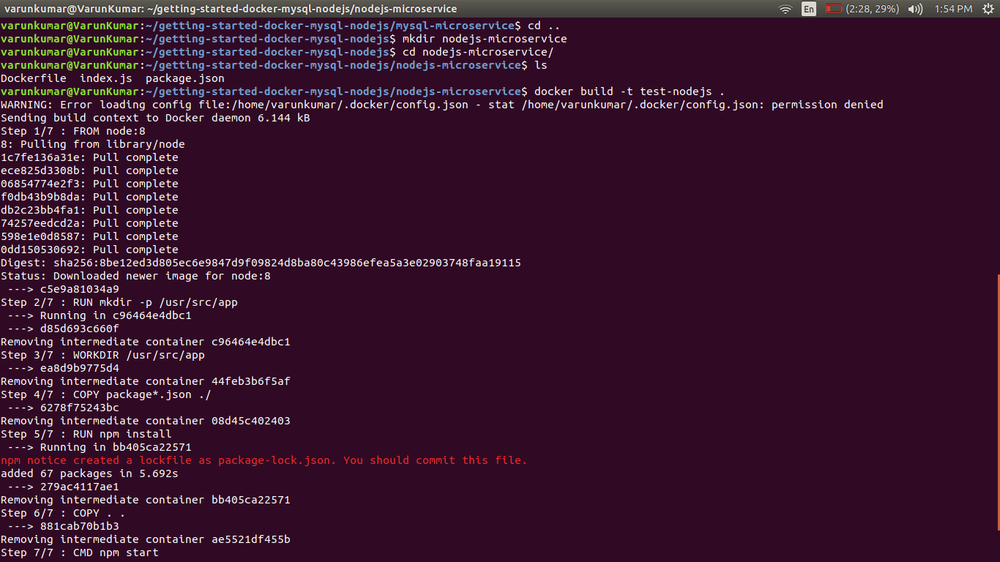
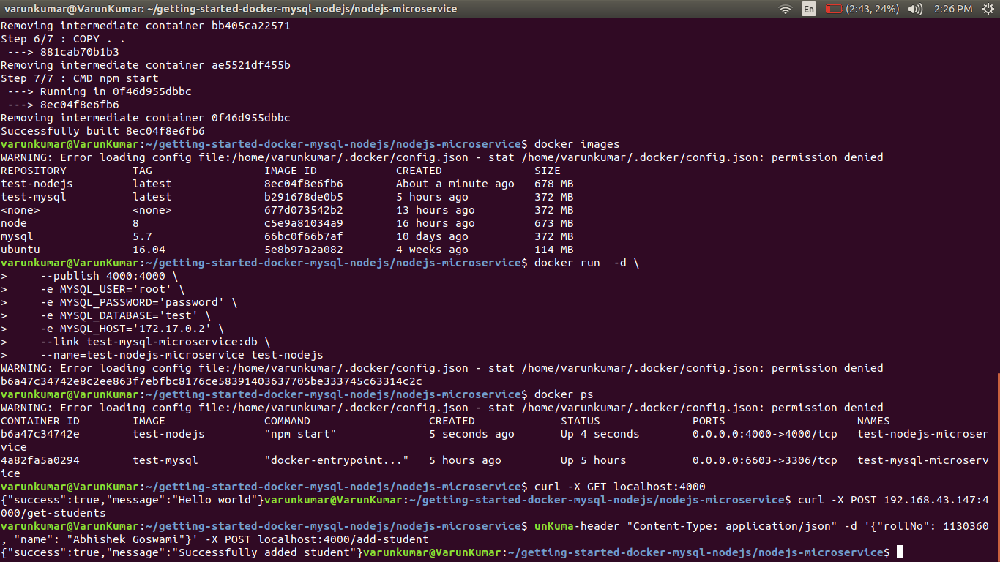

# getting started with docker-mysql-nodejs

Running a nodejs application with mysql database using docker and microservice architecture

### Our end goal

- Launch mysql server in a docker container.
- Launch our simple node app in a separate container.
- Link these two containers and test our integrated mysql-nodejs app.

### Youtube link-

Watch this tutorial at https://youtu.be/tIbMSqTEpfY

### Prerequisite

- must have docker set up and running on your system

### Launching mysql in a container

1. Create a directory for our tutorial `mkdir getting-started-docker-mysql-nodejs`
2. Move to this directory `cd getting-started-docker-mysql-nodejs/`
3. Create a directory for our mysql microservice `mkdir mysql-microservice`
4. Move to this directory `cd mysql-microservice/`
5. Create a Dockerfile with following content (name of file will be `Dockerfile`)
    ```
    ## Pull the mysql:5.7 image
    FROM mysql:5.7

    ## The maintainer name and email
    MAINTAINER Your Name <name@email.com>

    # database = test and password for root = password
    ENV MYSQL_DATABASE=test \
        MYSQL_ROOT_PASSWORD=password

    # when container will be started, we'll have `test` database created with this schema
    COPY ./test-dump.sql /docker-entrypoint-initdb.d/

    ```
6. We'll initialize our test database with a sample schema. 
Download [test-dump.sql](https://github.com/varunon9/getting-started-docker-mysql-nodejs/blob/master/mysql-microservice/test-dump.sql) and put it inside mysql-microservice folder along with Dockerfile

7. Create a data directory where mysql will store its content `mkdir data`. 
We will specify this directory while running our mysql container. 
On Linux default storage directory is `/var/lib/mysql` but in this tutorial we'll use a custom storage directory.

8. Build the image with Dockerfile `docker build -t test-mysql .` 
Note that we are inside mysql-microservice directory. `test-mysql` would be name of our image

9. You can check your newly built image using `docker images`


10. Run the newly created docker image as container 
    ```
    docker run  -d \
    --publish 6603:3306 \
    --volume=/home/varunkumar/getting-started-docker-mysql-nodejs/mysql-microservice/data:/var/lib/mysql \
    --name=test-mysql-microservice test-mysql
    ```

11. With above command we started our container in detach mode `-d` and mapped host(your machine) port 6603 with container port 3306 (mysql server) `--publish 6603:3306`. 
We are also using our custom data storage directory by specifying host path volume `--volume`.
Replace  `/home/varunkumar/getting-started-docker-mysql-nodejs/mysql-microservice/data` path to absolute path of data directory which you created on your system.
We are also naming our container as test-mysql-microservice `--name`

12. Check logs to see if everything went smooth `docker logs test-mysql-microservice`

13. Check your container state `docker ps`


14. We have successfully launched a mysql container


### Connecting to newly launched mysql container from host (optional)

To verify that our test-mysql-microservice container is up and running, we'll connect to it.
Follow below steps if you have mysql (mysql-client) installed on your system.

1. Check the ip of your system. On Linux use `ifconfig`. Lets say that ip is 192.168.43.147
2. Connect to test-mysql-microservice container with following params-
user-root, host=192.168.43.147, port=6603, database=test and password=password. 
Remember that we have specified root username and password in Dockerfile. 
Also our container is initialized with  test-dump.sql (a schema with database name test)

3. `mysql -u root -p -h 192.168.43.147 -P 6603 -D test` 
Use password=password when prompt and hit enter

4. If connected successfully you can see a sample table students `show tables` 
`exit` when done.


### Launching nodejs app in a container

1. Right now we are in mysql-microservice directory. We go to project root directory `cd ..`
2. create directory for node microservice `mkdir nodejs-microservice`
3. Move to this directory `cd nodejs-microservice/`
4. Create a Dockerfile with following content (name of file will be `Dockerfile`)
    ```
    # Use Node v8 as the base image.
    FROM node:8

    # create and set app directory
    RUN mkdir -p /usr/src/app
    WORKDIR /usr/src/app

    # Install app dependencies
    # A wildcard is used to ensure both package.json AND package-lock.json are copied
    # where available (npm@5+)
    COPY package*.json ./
    RUN npm install

    # Copy app source from current host directory to container working directory
    COPY . .

    # Run app
    CMD ["npm", "start"]

    ```
5. We need a package.json file for our node-microservice app as well as source code.
For this tutorial, I've already created one. 
Download [package.json](https://github.com/varunon9/getting-started-docker-mysql-nodejs/blob/master/nodejs-microservice/package.json) as well as [index.js](https://github.com/varunon9/getting-started-docker-mysql-nodejs/blob/master/nodejs-microservice/index.js) and put it inside nodejs-microservice folder along with Dockerfile.

6. Build the image with Dockerfile `docker build -t test-nodejs .` 
Note that we are inside nodejs-microservice directory. `test-nodejs` would be name of our image

7. You can check your newly built image using `docker images`


8. Run the newly created docker image as container 
    ```
    docker run  -d \
    --publish 4000:4000 \
    -e MYSQL_USER='root' \
    -e MYSQL_PASSWORD='password' \
    -e MYSQL_DATABASE='test' \
    -e MYSQL_HOST='172.17.0.2' \
    --link test-mysql-microservice:db \
    --name=test-nodejs-microservice test-nodejs
    ```


9. Explaination of above command-
* `-d` run in detach mode
* `--publish` map the host port 4000 to the container port 4000
* `-e` pass environment variables to nodejs app necessary to make mysql connection (check index.js file)
* `--link test-mysql-microservice:db` link to the container named test-mysql-microservice and refer to it as db
* `--name` naming our container as test-nodejs-microservice

10. How to know your MYSQL_HOST- 
Note that I am using `172.17.0.2` ip-address as MYSQL_HOST. This is the IpAddress of our test-mysql-microservice container.
You must replace this value to your container's ipAddress. Use `docker inspect test-mysql-microservice | grep IPAddress`


### Testing our complete app 

If everything is good so far then congratulations :smile: You have a complete app running with two microservices. To test this you can use CURL command from your host machine

1. Get homepage of your app `curl -X GET localhost:4000`

2. Get list of all students from test database `curl -X POST 192.168.43.147:4000/get-students`
Here 192.168.43.147 is my host IpAddress `ifconfig | grep inet`

3. Add a new student to your test db `curl --header "Content-Type: application/json" -d '{"rollNo": 1130360, "name": "Abhishek Goswami"}' -X POST localhost:4000/add-student`

4. Again fetch all students to see updated results `curl -X POST 192.168.43.147:4000/get-students`

5. Modify source code of nodejs app, build image, run container and test again.

### Queries/Comments

You can contact me at varunon9@gmail.com or create github issues.
