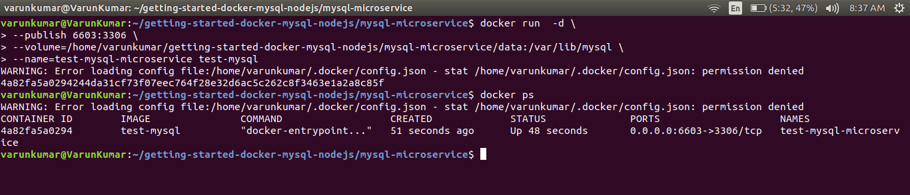
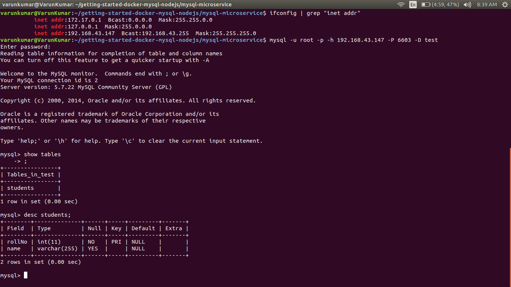

# getting started with docker-mysql-nodejs

Running a nodejs application with mysql database as microservices using docker
using microservice architecture

### our end goal

- Launch mysql server in a docker container.
- Launch our simple node app in a separate container.
- Link these two containers and test our integrated mysql-nodejs app.

### prerequisite

- must have docker set up and running on your system

### Launching mysql in a container

1. create a directory for our tutorial `mkdir getting-started-docker-mysql-nodejs`
2. move to this directory `cd getting-started-docker-mysql-nodejs/`
3. create a directory for our mysql microservice `mkdir mysql-microservice`
4. move to this directory `cd mysql-microservice/`
5. create a Dockerfile with following content (name of file will be `Dockerfile`)
    ```
    ## Pull the mysql:5.7 image
    FROM mysql:5.7

    ## The maintainer name and email
    MAINTAINER Your Name <name@email.com>

    # database = test and password for root = password
    ENV MYSQL_DATABASE=test \
        MYSQL_ROOT_PASSWORD=password

    # when container will be started, we'll have `test` database created with this schema
    COPY ./test-dump.sql /docker-entrypoint-initdb.d/

    ```
6. we'll initialize our test database with a sample schema. 
Download [test-dump.sql](https://github.com/varunon9/getting-started-docker-mysql-nodejs/blob/master/mysql-microservice/test-dump.sql) and put it inside mysql-microservice folder along with Dockerfile

7. create a data directory where mysql will store its content `mkdir data`. 
We will specify this directory wile running our mysql container. 
On Linux default storage directory is `/var/lib/mysql` but in this tutorial we'll use a custom storage directory.

8. build the image with Dockerfile `docker build -t test-mysql .` 
Note that we are inside mysql-microservice directory. `test-mysql` would be name of our image

9. you can check your newly built image using `docker images`


10. run the newly created docker image as container 
    ```
    docker run  -d \
    --publish 6603:3306 \
    --volume=/home/varunkumar/getting-started-docker-mysql-nodejs/mysql-microservice/data:/var/lib/mysql \
    --name=test-mysql-microservice test-mysql
    ```

11. with above command we started our container in detach mode `-d` and mapped host(your machine) port 6603 with container port 3306 (mysql server) `--publish 6603:3306`. 
We are also using our custom data storage directory by specifying host path volume `--volume`.
Replace  `/home/varunkumar/getting-started-docker-mysql-nodejs/mysql-microservice/data` path to absolute path of data directory which you created on your system.
We are also naming our container as test-mysql-microservice `--name`

12. check logs to see if everything went smooth `docker logs test-mysql-microservice`

13. check your container state `docker ps`


14. we have successfully launched a mysql container


### connecting to newly launched mysql container from host (optional)

To verify that our test-mysql-microservice container is up and running, we'll connect to it.
Follow below steps if you have mysql (mysql-client) installed on your system.

1. check the ip of your system. On Linux use `ifconfig`. Lets say that ip is 192.168.43.147
2. connect to test-mysql-microservice container with following params-
user-root, host=192.168.43.147, port=6603, database=test and password=password. 
Remember that we have specified root username and password in Dockerfile. 
Also our container is initialized with  test-dump.sql (a schema with database name test)

3. `mysql -u root -p -h 192.168.43.147 -P 6603 -D test` 
use password=password when prompt and hit enter

4. if connected successfully you can see a sample table students `show tables` 
`exit` when done.


